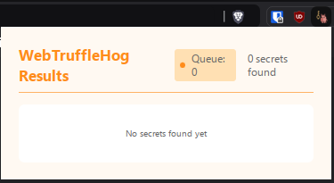

# WebTruffleHog


WebTruffleHog is a Chrome/Chromium extension that scans web traffic in real-time for exposed secrets using TruffleHog. It helps security professionals, bug bounty hunters and developers identify potential security risks by detecting sensitive information like API keys, passwords, and tokens that might be accidentally exposed in web responses.
## Key Features

- 🔍 **Real-time Scanning**: Automatically scans all web traffic for exposed secrets as you browse
- 🔌 **Native TruffleHog Integration**: Leverages the secret detection capabilities of TruffleHog
- 👀 **User-friendly Interface**: UI showing detected secrets with found URL, secret contents, and verification status
- ⚡ **High Performance**: Queue system and URL caching to handle large volumes of traffic without lagging your browser

## How it works?

WebTruffleHog leverages Chrome's webRequest API, specifically the onCompleted event listener, to analyze completed HTTP requests. Upon event triggering, the extension establishes communication with a native host process through Chrome's Native Messaging protocol.

The native host functions as a wrapper for the TruffleHog scanner, executing in an isolated process for security and stability. When receiving a URL, it initiates a fresh HTTP request to fetch and analyze the content, as direct access to Chrome's cache or local storage is architecturally restricted. While this approach ensures accurate scanning, it introduces limitations for authenticated sessions and dynamically generated content.

The implementation requires a Native Messaging Host manifest in Chrome's configuration directory (typically ~/.config/google-chrome on Linux systems), which establishes the bridge between the extension and the TruffleHog scanner process. 


## 🚀 Getting Started

### Prerequisites

- Linux-based operating system
- Chrome or Chromium-based browser
- Python 3.x
- TruffleHog (must be available in system PATH)

## Installation

1. Clone this repository: 
```bash
git clone https://github.com/c3l3si4n/webtrufflehog.git
```
2. Run the setup script pointing to your Chrome/Chromium config directory. (You can find that in chrome://version)
```bash
sudo ./setup.sh --chrome-dir /path/to/chrome/config
```
3. Reload your browser
4. Open chrome://extensions
5. Enable "Developer mode"
6. Click "Load unpacked"
7. Select the "/opt/webtrufflehog" directory and load the extension
8. Now you should see the extension icon in the toolbar. The tool works passively and is always scanning all visited URLs on your browser. 

# Usage

The tool works passively and is always scanning all visited URLs on your browser. 
You can view the results in the extension popup by clicking the icon in the toolbar.



# Troubleshooting

- If the tool is not working, you can check the logs in /opt/webtrufflehog/webtrufflehog.log
- Results are saved in /opt/webtrufflehog/results.json
- If you want to remove the tool, you can disable the extension in chrome://extensions and remove the native messaging host in your chrome directory.


# Warning

While I do this, I don't advise using this tool on your main browser. It probably takes quite a bit of performance overhead and could lag your browser, specially in high-traffic environments.

# Credits

- [TruffleHog](https://github.com/trufflesecurity/trufflehog) and Dylan from TruffleSec